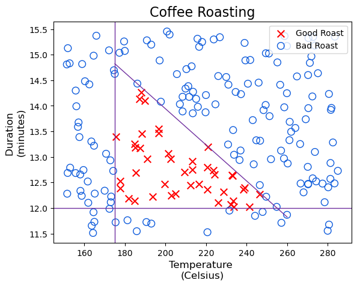

```python
import numpy as np
import matplotlib.pyplot as plt
import tensorflow as tf
from tensorflow.keras.models import Sequential
from tensorflow.keras.layers import Dense
from lab_utils_common import dlc
```


```python
import numpy as np
import matplotlib.pyplot as plt
import tensorflow as tf
from tensorflow.keras.activations import sigmoid
from matplotlib import cm
import matplotlib.colors as colors
from lab_utils_common import dlc

def load_coffee_data():
    """ Creates a coffee roasting data set.
        roasting duration: 12-15 minutes is best
        temperature range: 175-260C is best
    """
    rng = np.random.default_rng(2)
    X = rng.random(400).reshape(-1,2)
    X[:,1] = X[:,1] * 4 + 11.5          # 12-15 min is best
    X[:,0] = X[:,0] * (285-150) + 150  # 350-500 F (175-260 C) is best
    Y = np.zeros(len(X))
    
    i=0
    for t,d in X:
        y = -3/(260-175)*t + 21
        if (t > 175 and t < 260 and d > 12 and d < 15 and d<=y ):
            Y[i] = 1
        else:
            Y[i] = 0
        i += 1

    return (X, Y.reshape(-1,1))

def plt_roast(X,Y):
    Y = Y.reshape(-1,)
    colormap = np.array(['r', 'b'])
    fig, ax = plt.subplots(1,1,)
    ax.scatter(X[Y==1,0],X[Y==1,1], s=70, marker='x', c='red', label="Good Roast" )
    ax.scatter(X[Y==0,0],X[Y==0,1], s=100, marker='o', facecolors='none', 
               edgecolors=dlc["dldarkblue"],linewidth=1,  label="Bad Roast")
    tr = np.linspace(175,260,50)
    ax.plot(tr, (-3/85) * tr + 21, color=dlc["dlpurple"],linewidth=1)
    ax.axhline(y=12,color=dlc["dlpurple"],linewidth=1)
    ax.axvline(x=175,color=dlc["dlpurple"],linewidth=1)
    ax.set_title(f"Coffee Roasting", size=16)
    ax.set_xlabel("Temperature \n(Celsius)",size=12)
    ax.set_ylabel("Duration \n(minutes)",size=12)
    ax.legend(loc='upper right')
    plt.show()

def plt_prob(ax,fwb):
    """ plots a decision boundary but include shading to indicate the probability """
    #setup useful ranges and common linspaces
    x0_space  = np.linspace(150, 285 , 40)
    x1_space  = np.linspace(11.5, 15.5 , 40)

    # get probability for x0,x1 ranges
    tmp_x0,tmp_x1 = np.meshgrid(x0_space,x1_space)
    z = np.zeros_like(tmp_x0)
    for i in range(tmp_x0.shape[0]):
        for j in range(tmp_x1.shape[1]):
            x = np.array([[tmp_x0[i,j],tmp_x1[i,j]]])
            z[i,j] = fwb(x)


    cmap = plt.get_cmap('Blues')
    new_cmap = truncate_colormap(cmap, 0.0, 0.5)
    pcm = ax.pcolormesh(tmp_x0, tmp_x1, z,
                   norm=cm.colors.Normalize(vmin=0, vmax=1),
                   cmap=new_cmap, shading='nearest', alpha = 0.9)
    ax.figure.colorbar(pcm, ax=ax)

def truncate_colormap(cmap, minval=0.0, maxval=1.0, n=100):
    """ truncates color map """
    new_cmap = colors.LinearSegmentedColormap.from_list(
        'trunc({n},{a:.2f},{b:.2f})'.format(n=cmap.name, a=minval, b=maxval),
        cmap(np.linspace(minval, maxval, n)))
    return new_cmap

def plt_layer(X,Y,W1,b1,norm_l):
    Y = Y.reshape(-1,)
    fig,ax = plt.subplots(1,W1.shape[1], figsize=(16,4))
    for i in range(W1.shape[1]):
        layerf= lambda x : sigmoid(np.dot(norm_l(x),W1[:,i]) + b1[i])
        plt_prob(ax[i], layerf)
        ax[i].scatter(X[Y==1,0],X[Y==1,1], s=70, marker='x', c='red', label="Good Roast" )
        ax[i].scatter(X[Y==0,0],X[Y==0,1], s=100, marker='o', facecolors='none', 
                   edgecolors=dlc["dldarkblue"],linewidth=1,  label="Bad Roast")
        tr = np.linspace(175,260,50)
        ax[i].plot(tr, (-3/85) * tr + 21, color=dlc["dlpurple"],linewidth=2)
        ax[i].axhline(y= 12, color=dlc["dlpurple"], linewidth=2)
        ax[i].axvline(x=175, color=dlc["dlpurple"], linewidth=2)
        ax[i].set_title(f"Layer 1, unit {i}")
        ax[i].set_xlabel("Temperature \n(Celsius)",size=12)
    ax[0].set_ylabel("Duration \n(minutes)",size=12)
    plt.show()
        
def plt_network(X,Y,netf):
    fig, ax = plt.subplots(1,2,figsize=(16,4))
    Y = Y.reshape(-1,)
    plt_prob(ax[0], netf)
    ax[0].scatter(X[Y==1,0],X[Y==1,1], s=70, marker='x', c='red', label="Good Roast" )
    ax[0].scatter(X[Y==0,0],X[Y==0,1], s=100, marker='o', facecolors='none', 
                   edgecolors=dlc["dldarkblue"],linewidth=1,  label="Bad Roast")
    ax[0].plot(X[:,0], (-3/85) * X[:,0] + 21, color=dlc["dlpurple"],linewidth=1)
    ax[0].axhline(y= 12, color=dlc["dlpurple"], linewidth=1)
    ax[0].axvline(x=175, color=dlc["dlpurple"], linewidth=1)
    ax[0].set_xlabel("Temperature \n(Celsius)",size=12)
    ax[0].set_ylabel("Duration \n(minutes)",size=12)
    ax[0].legend(loc='upper right')
    ax[0].set_title(f"network probability")

    ax[1].plot(X[:,0], (-3/85) * X[:,0] + 21, color=dlc["dlpurple"],linewidth=1)
    ax[1].axhline(y= 12, color=dlc["dlpurple"], linewidth=1)
    ax[1].axvline(x=175, color=dlc["dlpurple"], linewidth=1)
    fwb = netf(X)
    yhat = (fwb > 0.5).astype(int)
    ax[1].scatter(X[yhat[:,0]==1,0],X[yhat[:,0]==1,1], s=70, marker='x', c='orange', label="Predicted Good Roast" )
    ax[1].scatter(X[yhat[:,0]==0,0],X[yhat[:,0]==0,1], s=100, marker='o', facecolors='none', 
                   edgecolors=dlc["dldarkblue"],linewidth=1,  label="Bad Roast")
    ax[1].set_title(f"network decision")
    ax[1].set_xlabel("Temperature \n(Celsius)",size=12)
    ax[1].set_ylabel("Duration \n(minutes)",size=12)
    ax[1].legend(loc='upper right')


def plt_output_unit(W,b):
    """ plots a single unit function with 3 inputs """
    steps = 10
    fig = plt.figure()
    ax = fig.add_subplot(projection='3d')
    x_ = np.linspace(0., 1., steps)
    y_ = np.linspace(0., 1., steps)
    z_ = np.linspace(0., 1., steps)
    x, y, z = np.meshgrid(x_, y_, z_, indexing='ij')
    d = np.zeros((steps,steps,steps))
    cmap = plt.get_cmap('Blues')
    for i in range(steps):
        for j in range(steps):
            for k in range(steps):
                v = np.array([x[i,j,k],y[i,j,k],z[i,j,k]])
                d[i,j,k] = tf.keras.activations.sigmoid(np.dot(v,W[:,0])+b).numpy()
    pcm = ax.scatter(x, y, z, c=d, cmap=cmap, alpha = 1 )
    ax.set_xlabel("unit 0"); 
    ax.set_ylabel("unit 1"); 
    ax.set_zlabel("unit 2"); 
    ax.view_init(30, -120)
    ax.figure.colorbar(pcm, ax=ax)
    ax.set_title(f"Layer 2, output unit")

    plt.show()
```

## Dataset


```python
def load_coffee_data():
    """ Creates a coffee roasting data set.
        roasting duration: 12-15 minutes is best
        temperature range: 175-260C is best
    """
    rng = np.random.default_rng(2)
    X = rng.random(400).reshape(-1,2)
    X[:,1] = X[:,1] * 4 + 11.5          # 12-15 min is best
    X[:,0] = X[:,0] * (285-150) + 150  # 350-500 F (175-260 C) is best
    Y = np.zeros(len(X))
    
    i=0
    for t,d in X:
        y = -3/(260-175)*t + 21
        if (t > 175 and t < 260 and d > 12 and d < 15 and d<=y ):
            Y[i] = 1
        else:
            Y[i] = 0
        i += 1

    return (X, Y.reshape(-1,1))
```


```python
X, Y = load_coffee_data();
print(X.shape, Y.shape)
```

    (200, 2) (200, 1)


## Plotting the data

Let's plot the coffee roasting data below. The two features are Temperature in Celsius and Duration in minutes. Coffee Roasting at Home suggests that the duration is best kept between 12 and 15 minutes while the temp should be between 175 and 260 degrees Celsius. Of course, as temperature rises, the duration should shrink.


```python
    Y = Y.reshape(-1,)
    colormap = np.array(['r', 'b'])
    fig, ax = plt.subplots(1,1,)
    ax.scatter(X[Y==1,0],X[Y==1,1], s=70, marker='x', c='red', label="Good Roast" )
    ax.scatter(X[Y==0,0],X[Y==0,1], s=70, marker='o', facecolors='none', 
               edgecolors=dlc["dldarkblue"],linewidth=1,  label="Bad Roast")
    tr = np.linspace(175,260,50)
    ax.plot(tr, (-3/85) * tr + 21, color=dlc["dlpurple"],linewidth=1)
    ax.axhline(y=12,color=dlc["dlpurple"],linewidth=1)
    ax.axvline(x=175,color=dlc["dlpurple"],linewidth=1)
    ax.set_title(f"Coffee Roasting", size=16)
    ax.set_xlabel("Temperature \n(Celsius)",size=12)
    ax.set_ylabel("Duration \n(minutes)",size=12)
    ax.legend(loc='upper right')
plt.show()
```


    

    


## Normalise the data

Fitting the weights to the data, will proceed more quickly if the data is normalized. This is the same procedure where features in the data are each normalised to have a similar range.

The procedure below uses Keras normalisation


```python
print(f"Temperature Max, Min pre normalization: {np.max(X[:,0]):0.2f}, {np.min(X[:,0]):0.2f}")
print(f"Duration Max, Min pre normalization:    {np.max(X[:,1]):0.2f}, {np.min(X[:,1]):0.2f}")

norm_l = tf.keras.layers.Normalization(axis=-1)
norm_l.adapt(X) #learns mean and variance
Xn = norm_l(X)

print(f"Temperature Max, Min pre normalization: {np.max(Xn[:,0]):0.2f}, {np.min(Xn[:,0]):0.2f}")
print(f"Duration Max, Min pre normalization:    {np.max(Xn[:,1]):0.2f}, {np.min(Xn[:,1]):0.2f}")
```

    Temperature Max, Min pre normalization: 284.99, 151.32
    Duration Max, Min pre normalization:    15.45, 11.51
    Temperature Max, Min pre normalization: 1.66, -1.69
    Duration Max, Min pre normalization:    1.79, -1.70


Tile our data to increase the training set size and reduce the number of training epochs


```python
Xt = np.tile(Xn,(1000,1))
Yt = np.tile(Y.reshape(-1, 1),(1000,1))   ##  
print(Xt.shape, Yt.shape) 

#Y.reshape() reshapes 'Y' to a column vector otherwise it gets tiled as if it is a row vector
```

    (200000, 2) (200000, 1)


# Tensorflow Model


```python
tf.random.set_seed(1234) #applied to achieve consistent results

layer_1 = Dense(units=3, activation="sigmoid", name='layer_1')
layer_2 = Dense(units=1, activation="sigmoid", name='layer_2')
model = Sequential(
    [
        tf.keras.Input(shape=(2,)), #This specifies the expected shape of the input.  
        layer_1, 
        layer_2
    ]
)

#Mentioning tf.keras.Input(shape=(2,)) allows tensorflow to size the weights and bais parameters at this point. 
#Including the sigmoid activation in the final layer is not considered the best practice.
#It would instead be accounted for in the loss which improves numerical stability.
```


```python
model.summary()
```

    Model: "sequential_1"
    _________________________________________________________________
     Layer (type)                Output Shape              Param #   
    =================================================================
     dense_2 (Dense)             (None, 3)                 9         
                                                                     
     dense_3 (Dense)             (None, 1)                 4         
                                                                     
    =================================================================
    Total params: 13 (52.00 Byte)
    Trainable params: 13 (52.00 Byte)
    Non-trainable params: 0 (0.00 Byte)
    _________________________________________________________________


The parameter counts correspond to the number of weights and bias arrays. 
In layer 1  the number of parameters would be input_shape * 3 + 3


```python
L1_num_params = 2 * 3 + 3   # W1 parameters  + b1 parameters
L2_num_params = 3 * 1 + 1   # W2 parameters  + b2 parameters
print("L1 params = ", L1_num_params, ", L2 params = ", L2_num_params  )
```

    L1 params =  9 , L2 params =  4


### Examining the model (weights and bias values)


```python
W1, b1 = model.get_layer('layer_1').get_weights()
W2, b2 = model.get_layer('layer_2').get_weights()

print(f"W1: \n{W1} \n\n b1 {b1.shape}: {b1}\n")
print(f"W2: \n{W2} \n\n b2 {b2.shape}: {b2}")
```

    W1: 
    [[-0.49 -0.75 -0.41]
     [-0.67 -1.04  0.39]] 
    
     b1 (3,): [0. 0. 0.]
    
    W2: 
    [[-0.46]
     [ 0.09]
     [ 0.17]] 
    
     b2 (1,): [0.]


### Compile and fit the model

compile statement defines a loss function and specifies a compiles optimisation
fit statement runs gradient descent and fits the weights to the data


```python
model.compile(
    loss = tf.keras.losses.BinaryCrossentropy(),
    optimizer = tf.keras.optimizers.legacy.Adam(learning_rate=0.01),
)

model.fit(
    Xt, Yt,
    epochs = 10,
)

#number of epochs determines that the entire data sest should be applied during training 10 times. 
```

    WARNING:absl:At this time, the v2.11+ optimizer `tf.keras.optimizers.Adam` runs slowly on M1/M2 Macs, please use the legacy Keras optimizer instead, located at `tf.keras.optimizers.legacy.Adam`.


    Epoch 1/10
    6250/6250 [==============================] - 2s 304us/step - loss: 0.1834
    Epoch 2/10
    6250/6250 [==============================] - 2s 293us/step - loss: 0.1228
    Epoch 3/10
    6250/6250 [==============================] - 2s 290us/step - loss: 0.0830
    Epoch 4/10
    6250/6250 [==============================] - 2s 290us/step - loss: 0.0215
    Epoch 5/10
    6250/6250 [==============================] - 2s 295us/step - loss: 0.0132
    Epoch 6/10
    6250/6250 [==============================] - 2s 296us/step - loss: 0.0093
    Epoch 7/10
    6250/6250 [==============================] - 2s 295us/step - loss: 0.0067
    Epoch 8/10
    6250/6250 [==============================] - 2s 295us/step - loss: 0.0049
    Epoch 9/10
    6250/6250 [==============================] - 2s 299us/step - loss: 0.0036
    Epoch 10/10
    6250/6250 [==============================] - 2s 292us/step - loss: 0.0027


    <keras.src.callbacks.History at 0x3151b2bd0>


For efficiency, the training data set is broken into 'batches'. The default size of a batch in Tensorflow is 32. There are 200000 examples data set or 6250 batches. 

### Updated weights


```python
W1, b1 = model.get_layer('layer_1').get_weights()
W2, b2 = model.get_layer('layer_2').get_weights()

print(f"W1: \n{W1} \n\n b1 {b1.shape}: {b1}\n")
print(f"W2: \n{W2} \n\n b2 {b2.shape}: {b2}")
```

    W1: 
    [[14.29 12.87 -0.02]
     [11.87  0.33 -8.87]] 
    
     b1 (3,): [  1.71  13.42 -11.15]
    
    W2: 
    [[-42.71]
     [ 37.56]
     [-44.31]] 
    
     b2 (1,): [-12.12]


## Predictions


```python
X_test = np.array([
    [200, 13.9],
    [200, 17]
])

X_test_n = norm_l(X_test)
predictions = model.predict(X_test_n)
print(f"Predictions = \n {predictions}")
```

    1/1 [==============================] - 0s 39ms/step
    Predictions = 
     [[9.87e-01]
     [3.13e-08]]


```python
# yhat = np.zeros_like(predictions)
# for i in range(len(predictions)):
#     if predictions[i] >= 0.5:
#         yhat[i] = 1
#     else:
#         yhat[i] = 0
# print(f"decisions = \n{yhat}")

yhat = (predictions >= 0.5).astype(int)
print(f"decisions = \n {yhat}")
```

    decisions = 
     [[1]
     [0]]

