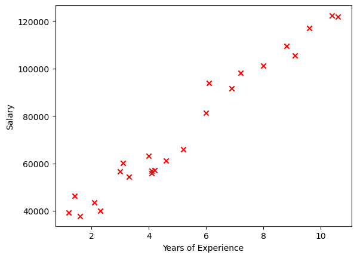
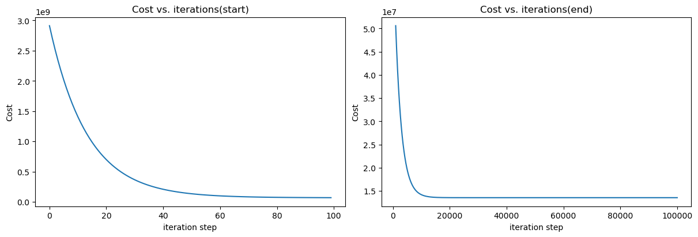
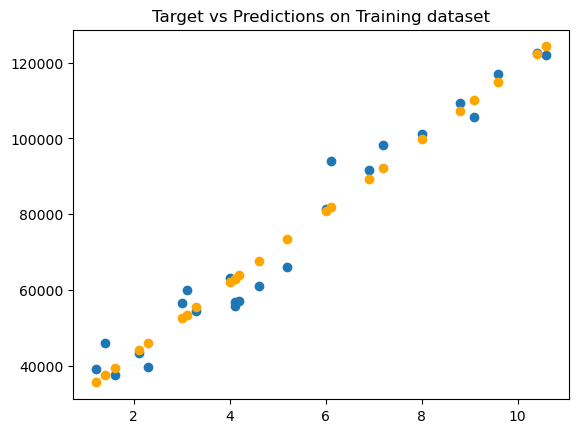
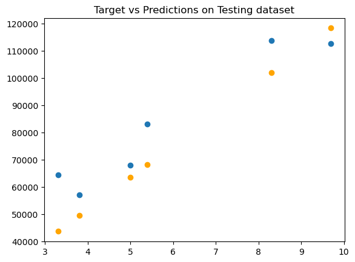

### Importing libraries


```python
import math
import numpy as np
import pandas as pd
import matplotlib.pyplot as plt
from sklearn.model_selection import train_test_split
```

### Spliting training and testing 


```python
df = pd.read_csv('data/salary_dataset.csv')
feature = ['YearsExperience']

X_train, X_test, y_train, y_test = train_test_split(df[feature], df['Salary'], random_state=42, test_size=.2)
X_train = X_train.values
y_train = y_train.values
X_test = X_test.values
y_test = y_test.values
X_train.shape

```


    (24, 1)


### Plotting the data


```python
plt.scatter(X_train, y_train, marker='x', c='r')
plt.ylabel("Salary")
plt.xlabel("Years of Experience")
plt.show()
```


    

    


### Compute Cost


```python
def compute_cost(x, y, w, b):
    m = x.shape[0]
    
    cost_sum = 0
    for i in range(m):
        f_wb = w * x[i] + b
        cost = (f_wb - y[i]) ** 2
        cost_sum = cost_sum + cost
    total_cost = (1/(2*m))*cost_sum

    return total_cost
```

### Gradient Descent


```python
def compute_gradient(x, y, w, b):
    m = x.shape[0]
    dj_dw = 0
    dj_db = 0
    
    for i in range(m):
        f_wb = w*x[i]+b
        dj_dw_i = (f_wb - y[i])*x[i]
        dj_db_i = f_wb - y[i]
        dj_db += dj_db_i
        dj_dw += dj_dw_i
    
    dj_dw = dj_dw / m
    dj_db = dj_db / m
    
    return dj_dw, dj_db
```


```python
def gradient_descent(x, y, w_in, b_in, alpha, num_iters, cost_function, gradient_function):
    
    #an array to store cost J and w's at each iteration primarily for graphing later
    J_history = []
    p_history = []
    b = b_in
    w = w_in
    
    for i in range(num_iters):
        #calculate the gadient and update the parameters using gradient_function
        dj_dw, dj_db = gradient_function(x, y, w, b)
        
        #update parameters 
        b = b - alpha * dj_db
        w = w - alpha * dj_dw
        
        #save cost J at each iteration
        if i<100000:
            J_history.append(cost_function(x, y, w, b))
            p_history.append([w, b])
            
        
    
    return w, b, J_history, p_history
```


```python
#initialise parameters
w_init = 0
b_init = 0

#some gradients descent settings
iterations = 100000
tmp_alpha = 1.0e-3

#run gradient descent
w_final, b_final, J_hist, p_hist = gradient_descent(X_train, y_train, w_init, b_init, tmp_alpha, iterations, compute_cost, compute_gradient)

print(f"(w, b) found by gradient descent: ({w_final.item():8.4f}, {b_final.item():8.4f})")
```

    (w, b) found by gradient descent: (9423.8153, 24380.2015)


```python
#plot cost versus iterations
fig, (ax1, ax2) = plt.subplots(1, 2, constrained_layout=True, figsize=(12, 4))
ax1.plot(J_hist[:100])
ax2.plot(1000+np.arange(len(J_hist[1000:])), J_hist[1000:])
ax1.set_title("Cost vs. iterations(start)"); ax2.set_title("Cost vs. iterations(end)")
ax1.set_ylabel('Cost'); ax2.set_ylabel('Cost')
ax1.set_xlabel('iteration step'); ax2.set_xlabel('iteration step')
plt.show()
```


    

    


### Predictions


```python
y_pred = w_final*X_test + b_final
y_pred
```


    array([[115791.21011463],
           [ 71499.27809353],
           [102597.86866153],
           [ 75268.80422298],
           [ 55478.79204334],
           [ 60190.69970516]])


### Accuracy


```python
#Mean absolute error
mae = np.mean(np.abs(y_pred-y_test))
print(f'Mean Absolute Error: {mae:.4f}')
```

    Mean Absolute Error: 25131.9846


```python
mse = np.mean((y_pred - y_test) ** 2)
r_squared = 1 - (np.sum((y_test - y_pred) ** 2) / np.sum((y_test - np.mean(y_test)) ** 2))

print(f'Mean Squared Error: {mse:.4f}')
print(f'R-squared: {r_squared:.4f}')
```

    Mean Squared Error: 1000068735.2498
    R-squared: -10.7472


## Using Sckit-Learn Library


```python
from sklearn.linear_model import SGDRegressor
from sklearn.preprocessing import StandardScaler
```

### Normalising the data


```python
scaler = StandardScaler()
X_norm = scaler.fit_transform(X_train)
print(f"Peak to Peak range by column in Raw.            X:{np.ptp(X_train, axis=0)}")
print(f"Peak to Peak range by column in Normalised.     X:{np.ptp(X_norm, axis=0)}")
```

    Peak to Peak range by column in Raw.            X:[9.4]
    Peak to Peak range by column in Normalised.     X:[3.26257267]


The "Peak to Peak" range in the raw dataset (X_train) is approximately 9.4.
After normalization (X_norm), the "Peak to Peak" range reduces significantly to approximately 3.26.

This reduction in the range indicates that normalization has effectively scaled the data to a smaller range, bringing the features closer together in scale.

### Create and fit the regression model


```python
sgdr = SGDRegressor(max_iter=1000)
sgdr.fit(X_norm, y_train)
print(sgdr)
b_norm = sgdr.intercept_
w_norm = sgdr.coef_
print(f"Model parameters:  w:{w_norm} and b:{b_norm}")
```

    SGDRegressor()
    Model parameters:  w:[27141.09311888] and b:[74193.24926319]


### Make predictions


```python
y_pred_sgd = sgdr.predict(X_norm)
y_pred = np.dot( X_norm, w_norm) + b_norm

print(f"Prediction using np.dot() and sgdr.predict match: {(y_pred_sgd==y_pred).all()}")
print(f"Prediction on training set: {y_pred[:4]}")
print(f"Target values: {y_train[:4]}")
```

    Prediction using np.dot() and sgdr.predict match: True
    Prediction on training set: [122353.97212084 107281.66765683  63006.77329381  35688.22145279]
    Target values: [122392. 109432.  56958.  39344.]


## Accuracy


```python
mse = np.mean((y_pred_sgd - y_train) ** 2)
r_squared = 1 - (np.sum((y_train - y_pred_sgd) ** 2) / np.sum((y_train - np.mean(y_train)) ** 2))

print(f'Mean Squared Error: {mse:.4f}')
print(f'R-squared: {r_squared:.4f}')
```

    Mean Squared Error: 27102595.2281
    R-squared: 0.9645


#### On the testing set


```python
X_norm_test = scaler.fit_transform(X_test)
y_pred_sgd_test = sgdr.predict(X_norm_test)
y_pred_test = np.dot( X_norm_test, w_norm) + b_norm

print(f"Prediction using np.dot() and sgdr.predict match: {(y_pred_sgd_test==y_pred_test).all()}")
print(f"Prediction on training set: {y_pred_test[:4]}")
print(f"Target values: {y_test[:4]}")
```

    Prediction using np.dot() and sgdr.predict match: True
    Prediction on training set: [118362.0139239   63491.56619562 102017.62523888  68161.39153419]
    Target values: [112636.  67939. 113813.  83089.]


## Accuracy


```python
mse = np.mean((y_pred_sgd_test - y_test) ** 2)
r_squared = 1 - (np.sum((y_test - y_pred_sgd_test) ** 2) / np.sum((y_test - np.mean(y_test)) ** 2))

print(f'Mean Squared Error: {mse:.4f}')
print(f'R-squared: {r_squared:.4f}')
```

    Mean Squared Error: 151105450.7504
    R-squared: 0.7042


## Plot the results


```python
#plot predictions and targets
plt.title("Target vs Predictions on Training dataset")
plt.scatter(X_train, y_train, label='target')
plt.scatter(X_train, y_pred, label='predicted', color='orange')
```


    <matplotlib.collections.PathCollection at 0x169093010>


    

    


```python
#plot predictions and targets
plt.title("Target vs Predictions on Testing dataset")
plt.scatter(X_test, y_test, label='target')
plt.scatter(X_test, y_pred_test, label='predicted', color='orange')
```


    <matplotlib.collections.PathCollection at 0x1690fd210>


    

    


```python

```
